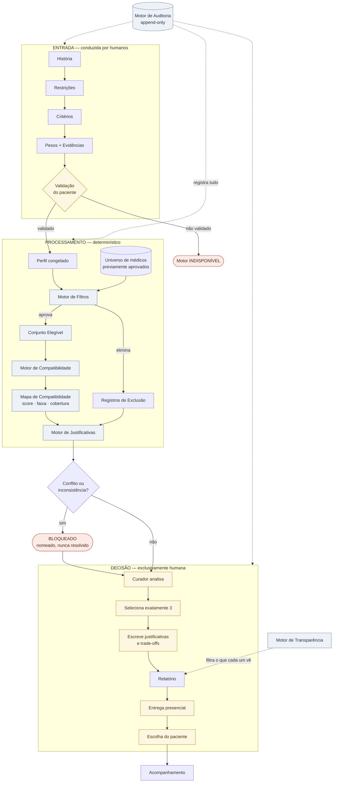
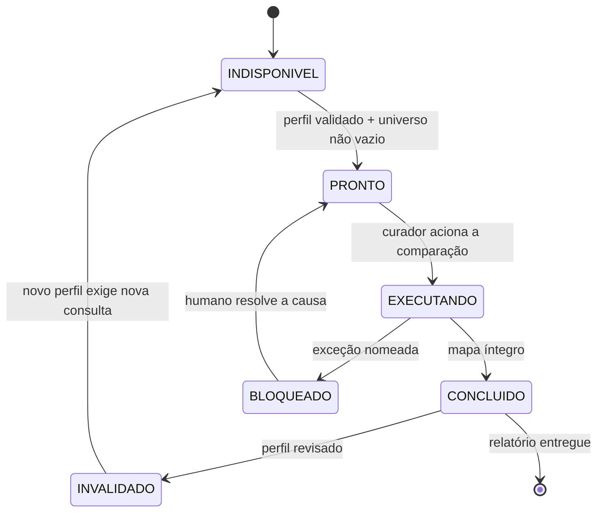

# Especificação do Motor de Curadoria

**Estado**: **Proposto** — aguardando aprovação do responsável do projeto.

**O que é.** A especificação do **processo interno** da Curadoria Compartilhada: como uma Curadoria nasce, evolui e termina. Define **regras**, não código. Nenhuma implementação foi criada ou alterada nesta missão.

**Autoridade.** Abaixo de [`FUNDAMENTOS_DO_METODO_ALIVIAR.md`](FUNDAMENTOS_DO_METODO_ALIVIAR.md) (o método), [`ONTOLOGIA_CURADORIA_COMPARTILHADA.md`](ONTOLOGIA_CURADORIA_COMPARTILHADA.md) (o domínio) e [`EXPERIENCE_BIBLE.md`](EXPERIENCE_BIBLE.md) (a experiência). Nada aqui pode contradizê-los; onde houver conflito, eles prevalecem e esta especificação é corrigida.

---

## 1. A lei do Motor

Uma frase governa tudo o que vem abaixo:

> **O Motor calcula, organiza, verifica e explica. O Motor nunca decide, nunca seleciona e nunca resolve um conflito.**

Disso derivam três leis operacionais:

**L1 — Toda ambiguidade sobe para um humano.** O Motor nunca desempata, nunca escolhe entre alternativas equivalentes, nunca completa o que falta. Diante de qualquer ambiguidade ele **nomeia, quantifica e para**.

**L2 — Nada é inventado.** Dado ausente é registrado como ausência. Nunca é substituído por média, valor padrão, inferência ou zero disfarçado de nota baixa.

**L3 — Nada entra sem explicação.** Qualquer resultado que não possa ser dito em uma frase compreensível ao paciente é rejeitado pelo Motor — não escondido, rejeitado.

---

## 2. Como nasce, evolui e termina uma Curadoria

### Nasce
Uma Curadoria nasce **exclusivamente** de um ato humano: o Curador inicia a análise sobre um Caso que possui um Perfil de Prioridades validado pelo paciente.

Não existe nascimento automático. Nenhum agendamento, nenhuma fila, nenhum gatilho de sistema cria uma Curadoria.

**Pré-condições de nascimento** (todas obrigatórias):
1. Existe um Caso em estado `Em curadoria`.
2. Existe um Perfil de Prioridades em estado `Validado`.
3. O Perfil possui pesos somando exatamente 100, cada um com Evidência de Curadoria.
4. Existe ao menos um Médico `Ativo` no universo aprovado.
5. Há um Curador atribuído.

Falha em qualquer uma: a Curadoria não nasce, e a pré-condição violada é nomeada (§9).

### Evolui
Por **passos humanos**, cada um deles apoiado por um motor:

```
Iniciada → Em análise → Comparação → Revisão → Concluída
```

O Motor nunca avança um estado sozinho. Cada transição tem um ator humano e fica registrada com o nome dele.

### Termina
De três formas, todas legítimas:

| Término | Como acontece |
|---|---|
| **Concluída** | Relatório emitido com exatamente três opções e entregue por um Curador. |
| **Bloqueada** | Uma exceção do §9 impede continuar de forma responsável. Não é falha do sistema — é o Método se recusando a produzir algo mal fundamentado. |
| **Invalidada** | O Perfil de Prioridades foi revisado. Toda análise derivada dele morre junto; nada é reaproveitado. |

Uma Curadoria **nunca** termina por tempo, por inatividade ou por decisão automática.

---

## 3. Entrada

A entrada é construída em cadeia, e a ordem é obrigatória. **Nenhuma etapa pode ser executada antes da anterior estar completa** — comparar antes de priorizar é decidir pelo paciente com aparência de método.

```
História → Filtros → Critérios → Pesos → Validação
```

| Elemento | Origem | Natureza | Obrigatório |
|---|---|---|---|
| **História** | Consulta Inicial, etapa Compreender | Texto livre, palavras do paciente | Sim |
| **Filtros** | Restrições declaradas pelo paciente | Pares `tipo = valor`, binários | Não (zero é válido) |
| **Critérios** | Escolhidos pelo Curador com o paciente | Vocabulário do catálogo oficial | Sim, ao menos 1 |
| **Pesos** | Atribuídos pelo paciente, formalizados pelo Curador | Inteiro 0–100 + Evidência | Sim, soma = 100 |
| **Validação** | Ato do paciente | Registro datado com nota do Curador | Sim |

**Regra de fronteira:** a entrada do Motor é sempre um **Perfil validado e congelado**. O Motor nunca lê rascunho, nunca lê Perfil em construção, nunca opera sobre entrada parcial.

---

## 4. Processamento

### 4.1 Como os filtros eliminam opções

Filtros são **binários e eliminatórios**, aplicados antes de qualquer cálculo.

1. O universo inicial é o conjunto de Médicos em estado `Ativo`. **Nunca uma busca, nunca uma fonte externa, nunca um cadastro criado na hora.**
2. Cada médico é avaliado contra **todos** os filtros. Não há filtro parcial: atende ou não atende.
3. Falha em **qualquer** filtro elimina o médico — os filtros são conjuntivos (E lógico), nunca disjuntivos.
4. Toda eliminação gera um **Registro de Exclusão** com o motivo em linguagem humana. Nenhum descarte é silencioso.
5. Um médico sem o dado necessário para avaliar um filtro **é eliminado**, e o motivo declara que a causa foi ausência de dado, não desatendimento.

> Diferença essencial em relação aos pesos: **em filtro, dado ausente elimina; em peso, dado ausente não pontua e não penaliza.** A assimetria é deliberada — um requisito obrigatório não confirmado não pode ser presumido como atendido.

6. **Filtros nunca são afrouxados pelo Motor.** Se o universo esvaziar, isso vira exceção (E-01), nunca uma flexibilização automática.

### 4.2 Como os pesos influenciam

Os pesos convertem prioridade declarada em influência proporcional.

1. Cada Critério com peso vira uma **dimensão** da comparação. Critério sem peso não existe.
2. Para cada dimensão, o Motor calcula um **alinhamento** de 0 a 100 entre o Perfil Médico e o que o paciente priorizou.
3. A **contribuição** de uma dimensão é `peso × alinhamento ÷ 100`.
4. O **score interno** é a soma das contribuições normalizada pelo peso efetivamente avaliável:

   ```
   score = (Σ contribuições ÷ pesoAvaliável) × 100
   ```

   onde `pesoAvaliável` é a soma dos pesos das dimensões que tinham dado.

**Por que normalizar.** Um médico com cadastro incompleto não é punido com nota baixa — ele é avaliado sobre o que se sabe, e a lacuna fica explícita. Punir a ausência transformaria falha de cadastro em julgamento sobre a pessoa, o que viola L2.

5. O Motor devolve sempre, junto do score, a **cobertura**: quantos dos 100 pontos puderam ser avaliados e quantas dimensões ficaram sem dado. **Score sem cobertura é proibido** — é a medida honesta da confiança naquela análise.

**Tabelas de alinhamento** (fechadas, auditáveis, idênticas para todos os pacientes):

| Dimensão | Alinhamento |
|---|---|
| Experiência | altamente experiente 100 · experiente 70 · geral 40 |
| Área de atuação | corresponde à área priorizada 100 · área não determinada 40 · outra área 0 |
| Disponibilidade | agenda aberta 100 · agenda limitada 60 · sem agenda próxima 10 |
| Continuidade | acompanha ao longo do tempo 100 · atende pontualmente 0 |
| Forma do primeiro encontro | corresponde à preferência 100 · adapta-se a ambas 85 · difere 30 |
| Localização | região priorizada 100 · outra região 20 |

Dimensões que exigem alvo declarado pelo paciente (Área de atuação, Forma do primeiro encontro, Localização) **nunca** têm alvo inferido. Sem alvo, a dimensão é tratada como sem dado.

6. **Faixas** (nível externo):

| Faixa | Score |
|---|---|
| Muito Alta | ≥ 85 |
| Alta | ≥ 70 |
| Boa | ≥ 55 |
| Moderada | < 55 |

7. **Nenhuma dimensão tem peso implícito.** O Motor não acrescenta critérios "padrão", não pondera nada por conta própria, não corrige uma distribuição que considere estranha.

### 4.3 Como incompatibilidades aparecem

Uma **incompatibilidade** é uma dimensão em que o médico responde mal ao que o paciente priorizou — e ela nunca é escondida.

| Tipo | Como aparece |
|---|---|
| **Incompatibilidade forte** | Alinhamento ≤ 30 em dimensão com peso ≥ 20. Sinalizada explicitamente ao Curador. |
| **Incompatibilidade leve** | Alinhamento ≤ 30 em dimensão com peso < 20. Registrada, sem destaque. |
| **Lacuna** | Dimensão sem dado. Aparência **neutra** — nunca vermelha, nunca ícone de erro. |
| **Eliminação** | Falha em filtro. Sai do conjunto, com motivo registrado. |

Uma incompatibilidade forte **nunca impede** o Curador de selecionar aquele médico — ela obriga o Curador a declarar o trade-off correspondente na apresentação. É assim que a Experience Bible §2.5 exige que toda opção diga o que custa.

### 4.4 Como inconsistências são detectadas

Inconsistência é uma **contradição interna**: o estado dos dados viola uma regra do Método. O Motor verifica antes de cada etapa e recusa-se a prosseguir.

| Código | Inconsistência | Quando é verificada |
|---|---|---|
| I-01 | Soma dos pesos ≠ 100 | Antes da validação |
| I-02 | Peso sem Evidência de Curadoria | Antes da validação |
| I-03 | Mesmo aspecto como Critério e como Restrição | Antes da validação |
| I-04 | Critério que exige alvo, sem alvo declarado | Antes da validação |
| I-05 | Critério duplicado no Perfil | Ao registrar o peso |
| I-06 | Perfil validado sem registro do ato de validação | Antes da comparação |
| I-07 | Análise calculada sobre Perfil já revisado | Ao ler qualquer análise |
| I-08 | Resultado de dimensão sem explicação | Ao construir a análise |
| I-09 | Seleção com número diferente de três | Ao salvar a seleção |
| I-10 | Mesmo médico repetido na seleção | Ao salvar a seleção |
| I-11 | Opção selecionada sem análise que a fundamente | Ao salvar a seleção |
| I-12 | Seleção sem autor humano | Ao salvar a seleção |
| I-13 | Relatório com opção cujo médico saiu do universo | Antes da emissão |

**Postura do Motor diante de uma inconsistência: rejeitar, nunca corrigir.** O Motor não ajusta um peso para fechar 100, não remove um critério duplicado, não escolhe qual das duas declarações vale. Ele nomeia a inconsistência e devolve ao humano.

### 4.5 Como conflitos são resolvidos

**Não são.** Esta seção existe para deixar isso explícito.

Um **conflito** é diferente de uma inconsistência: os dados estão coerentes, mas a situação admite mais de um caminho legítimo. O Motor **nunca escolhe** entre eles.

| Código | Conflito | O que o Motor faz |
|---|---|---|
| C-01 | Mais de três médicos com score equivalente (diferença < 3 pontos) | Apresenta todos os empatados, marcados como equivalentes. Não desempata. |
| C-02 | Restrições mutuamente exclusivas | Nomeia o par incompatível. Não descarta nenhuma. |
| C-03 | Prioridade alta contra restrição que a inviabiliza | Nomeia a tensão em uma frase. Não pondera. |
| C-04 | Menos de três médicos elegíveis | Informa quantos há e por que os outros saíram. Não afrouxa filtro. |
| C-05 | Nenhuma opção acima de "Moderada" | Informa a distribuição real. Não relativiza a faixa. |
| C-06 | Cobertura média muito baixa (< 50% dos pontos avaliáveis) | Declara que o universo tem cadastro insuficiente. Não estima o que falta. |

**A regra de ouro:** um empate não é um problema a resolver por critério técnico — é uma informação de que aquelas opções são realmente equivalentes sob os critérios do paciente. Desempatar por ordem alfabética, por identificador ou por qualquer critério não declarado seria o software decidindo com aparência de neutralidade. Todo conflito sobe para o Curador; C-02, C-03 e C-04 costumam subir do Curador para o paciente, porque só ele pode rever a própria prioridade.

### 4.6 Como justificativas são geradas

Toda saída do Motor nasce acompanhada da sua explicação. **A justificativa não é gerada depois — é gerada junto, e sem ela o resultado não existe.**

**Três níveis:**

1. **Justificativa de dimensão** — uma frase por dimensão avaliada, derivada da tabela de alinhamento: *"Tem agenda aberta para começar logo."* Determinística: mesmo dado, mesma frase.
2. **Justificativa de exclusão** — uma frase por médico eliminado: *"Não atua em SP."* / *"Não tem a área de atuação exigida registrada."*
3. **Justificativa de opção e de composição** — **escritas pelo Curador**, nunca pelo Motor. O Motor fornece o material; a explicação de por que estas três, juntas, servem a este paciente é obrigação humana.

**Regras**
- Nenhuma justificativa nomeia mecanismo interno, critério técnico ou score.
- Nenhuma justificativa usa jargão clínico.
- Lacuna sempre gera frase própria, que declara a ausência: *"…não está registrado no cadastro deste profissional — nada foi presumido."*
- **Resultado sem justificativa é bloqueado (I-08).** É a mecanização de "se não pode ser explicado, não pode ser usado".

---

## 5. Os seis motores

Cada motor tem responsabilidade única, entrada e saída definidas, e uma lista explícita do que nunca faz.

### 5.1 Motor de Filtros — *como eliminar médicos*

| | |
|---|---|
| **Entrada** | Universo de médicos `Ativos` + Restrições do Perfil validado |
| **Saída** | Conjunto Elegível + Registros de Exclusão (um por eliminado) |
| **Responsabilidade** | Reduzir o universo ao que atende a todos os requisitos obrigatórios |
| **Nunca** | Ordena · pontua · afrouxa um filtro · elimina sem registrar motivo · busca fora do universo aprovado |
| **Exceções** | E-01 (universo vazio), C-02, C-04 |

### 5.2 Motor de Pesos — *como transformar prioridades*

| | |
|---|---|
| **Entrada** | Critérios escolhidos + valores atribuídos pelo paciente + Evidências |
| **Saída** | Distribuição validada de 100 pontos, congelada |
| **Responsabilidade** | Formalizar prioridade declarada em influência proporcional, sempre rastreável a uma fala |
| **Nunca** | Sugere valor · autoajusta um peso quando outro muda · herda de casos parecidos · infere de comportamento · aceita peso sem evidência · fecha 100 por conta própria |
| **Exceções** | I-01 a I-05 |

**Nota de experiência:** o autoajuste é tecnicamente trivial e está proibido. Ajustar automaticamente os outros pesos quando um muda tira do paciente o controle da própria prioridade (Experience Bible §6).

### 5.3 Motor de Compatibilidade — *como comparar*

| | |
|---|---|
| **Entrada** | Conjunto Elegível + Perfis Médicos + Distribuição de pesos |
| **Saída** | Mapa de Compatibilidade — uma análise por médico, com dimensões, contribuições, score, faixa e cobertura |
| **Responsabilidade** | Medir o encontro entre cada Perfil Médico e o Perfil de Prioridades |
| **Nunca** | Seleciona · corta a lista · marca favorito · produz ranking universal · usa dado de outro paciente · pontua dimensão sem dado · desempata |
| **Exceções** | C-01, C-05, C-06, I-07 |

**Determinismo obrigatório:** mesma entrada, mesma saída, sempre. Nenhuma aleatoriedade, nenhum modelo de linguagem, nenhuma variação entre execuções. Uma análise que não pode ser reproduzida não pode ser auditada.

**Invalidação em cascata:** revisar o Perfil invalida todo o Mapa. Análises invalidadas nunca são reaproveitadas, nem parcialmente.

### 5.4 Motor de Justificativas — *como explicar*

| | |
|---|---|
| **Entrada** | Mapa de Compatibilidade + Registros de Exclusão |
| **Saída** | Frase de dimensão, frase de exclusão, e o material que o Curador usa para escrever as justificativas humanas |
| **Responsabilidade** | Garantir que nada saia do Motor sem tradução para linguagem de pessoa |
| **Nunca** | Escreve a justificativa da opção ou da composição · usa jargão · nomeia mecanismo · omite lacuna · gera texto variável para o mesmo dado |
| **Exceções** | I-08 |

### 5.5 Motor de Transparência — *como registrar*

Governa **quem vê o quê**. É o motor que impede que o nível interno vaze para o nível externo.

| Informação | Paciente | Curador | Auditoria |
|---|---|---|---|
| Seus pesos e evidências | ✅ | ✅ | ✅ |
| Suas restrições | ✅ | ✅ | ✅ |
| Faixa de compatibilidade das 3 opções | ✅ | ✅ | ✅ |
| Distribuição por critério das 3 opções | ✅ | ✅ | ✅ |
| Justificativa e trade-off de cada opção | ✅ | ✅ | ✅ |
| **Score interno** | ❌ | ✅ | ✅ |
| **Lista completa de analisados** | ❌ | ✅ | ✅ |
| **Médicos eliminados e por quê** | ❌ | ✅ | ✅ |
| **Cobertura e lacunas de cadastro** | ❌ | ✅ | ✅ |
| Quem selecionou as três, e quando | ✅ | ✅ | ✅ |

**Nunca**, em nenhuma circunstância: score numérico ao paciente · lista dos não escolhidos ao paciente · nome de mecanismo interno em superfície do paciente · dado de um paciente visível a outro.

**Por que o paciente não vê os eliminados.** Não é opacidade: é proteção de terceiros. Publicar "estes médicos foram descartados" produz um juízo sobre profissionais que não participaram da conversa — e a compatibilidade nunca é característica do médico. O que o paciente sempre pode saber é **por que critério** algo foi excluído, nunca **quem**.

### 5.6 Motor de Auditoria — *como rastrear*

| | |
|---|---|
| **Entrada** | Todo evento de todos os motores |
| **Saída** | Trilha append-only, imutável |
| **Responsabilidade** | Permitir reconstruir qualquer Curadoria, integralmente, a qualquer momento |
| **Nunca** | Permite edição · permite exclusão · registra sem autor · registra sem instante · guarda dado além do necessário |

**Teste de reconstrução** — o critério de suficiência da auditoria. Uma Curadoria é auditável quando, meses depois, é possível responder a todas estas perguntas apenas com o registro:

1. Quem conduziu a Consulta Inicial e quando?
2. Quais pesos foram atribuídos, e qual fala originou cada um?
3. Quando e como o paciente validou?
4. Quais médicos foram eliminados, por qual filtro?
5. Qual era o Perfil Médico de cada analisado **naquele momento**?
6. Qual score e qual cobertura cada um teve?
7. Quem escolheu as três, quando, e com qual justificativa?
8. Quem entregou o Relatório, e quando?
9. O que o paciente decidiu, e quando?

Se qualquer resposta faltar, a trilha é insuficiente — e isso é um defeito do Motor, não uma limitação aceitável.

**Regra de imutabilidade histórica:** alterar um Perfil Médico hoje nunca reescreve uma análise de ontem. A auditoria preserva o estado que foi efetivamente usado.

---

## 6. Estados

### Estados de execução do Motor

| Estado | Significado |
|---|---|
| `INDISPONÍVEL` | Pré-condições não atendidas; o Motor não pode ser acionado. |
| `PRONTO` | Perfil validado e universo não vazio; aguardando ação humana. |
| `EXECUTANDO` | Cálculo em andamento. Estado curto, determinístico. |
| `CONCLUÍDO` | Mapa de Compatibilidade produzido e íntegro. |
| `BLOQUEADO` | Exceção do §9 impede prosseguir. Sempre com causa nomeada. |
| `INVALIDADO` | O Perfil que originou o resultado foi revisado. |

### Estados de domínio

Definidos na Ontologia §5 e não redefinidos aqui. O Motor observa e nunca contradiz:

Perfil de Prioridades `Rascunho → Em construção → Validado → Congelado → Revisado` · Curadoria `Iniciada → Em análise → Comparação → Revisão → Concluída` · Compatibilidade `Não calculada → Calculada → Invalidada` · Relatório `Em elaboração → Emitido → Entregue` · Escolha `Aguardando → Registrada`

---

## 7. Eventos

Todos append-only, todos com autor e instante.

**Consulta e Perfil**
`CONSULTA_INICIADA` · `HISTORIA_REGISTRADA` · `RESTRICAO_ADICIONADA` · `RESTRICAO_REMOVIDA` · `CRITERIO_ADICIONADO` · `PESO_ATRIBUIDO` · `PESO_ALTERADO` · `PESO_REMOVIDO` · `EVIDENCIA_REGISTRADA` · `PERFIL_VALIDADO` · `PERFIL_CONGELADO` · `PERFIL_REVISADO`

**Filtros e Compatibilidade**
`FILTROS_APLICADOS` · `MEDICO_ELIMINADO` · `CONJUNTO_ELEGIVEL_FORMADO` · `COMPATIBILIDADE_CALCULADA` · `LACUNA_DETECTADA` · `INCOMPATIBILIDADE_FORTE_DETECTADA` · `MAPA_INVALIDADO`

**Curadoria e entrega**
`CURADORIA_INICIADA` · `OPCAO_SELECIONADA` · `OPCAO_REMOVIDA` · `JUSTIFICATIVA_REGISTRADA` · `SELECAO_FECHADA` · `RELATORIO_EMITIDO` · `RELATORIO_ENTREGUE`

**Decisão e continuidade**
`ESCOLHA_REGISTRADA` · `NENHUMA_OPCAO_ESCOLHIDA` · `ACOMPANHAMENTO_INICIADO`

**Excepcionais**
`INCONSISTENCIA_DETECTADA` · `CONFLITO_DETECTADO` · `CURADORIA_BLOQUEADA` · `PRAZO_RENEGOCIADO`

---

## 8. Gatilhos

| Gatilho | Origem | Dispara | Automático? |
|---|---|---|---|
| Curador inicia a Consulta | Humano | `CONSULTA_INICIADA` | Não |
| Paciente valida o Perfil | Humano | `PERFIL_VALIDADO` → verificações I-01…I-06 | Não |
| Validação bem-sucedida | Sistema | Congelamento do Perfil; Motor vai a `PRONTO` | **Sim** |
| Curador aciona a comparação | Humano | Motor de Filtros → Motor de Compatibilidade → Motor de Justificativas | Não |
| Curador seleciona uma opção | Humano | `OPCAO_SELECIONADA` | Não |
| Curador fecha a seleção | Humano | Verificações I-09…I-12 | Não |
| Curador emite o Relatório | Humano | Verificação I-13 → `RELATORIO_EMITIDO` | Não |
| Curador entrega o Relatório | Humano | `RELATORIO_ENTREGUE`; Escolha vai a `Aguardando` | Não |
| Paciente decide | Humano | `ESCOLHA_REGISTRADA` ou `NENHUMA_OPCAO_ESCOLHIDA` | Não |
| Perfil é revisado | Humano | Invalidação em cascata do Mapa | **Sim** |
| Médico sai do universo | Humano | Marca análises afetadas; alerta o Curador | **Sim** |

**Os únicos gatilhos automáticos são de verificação, congelamento e invalidação.** Nenhum gatilho automático produz decisão, seleção, entrega ou comunicação ao paciente. Toda comunicação ao paciente parte de uma pessoa.

---

## 9. Exceções

Cada uma com causa, comportamento do Motor, o que o Curador vê e o que o paciente vê — este último sempre em conformidade com a Experience Bible.

| Código | Causa | Motor | Curador vê | Paciente vê |
|---|---|---|---|---|
| **E-01** | Filtros eliminaram todos | Bloqueia | Quais filtros eliminaram quantos, um a um | Nada automático — o Curador conversa e revê as restrições com ele |
| **E-02** | Menos de três elegíveis | Bloqueia a seleção | Quantos há e por que os demais saíram | Conversa honesta, conduzida pelo Curador |
| **E-03** | Universo aprovado vazio | `INDISPONÍVEL` | Aviso operacional claro | Nada — falha interna nunca vira ansiedade do paciente |
| **E-04** | Empate acima de três (C-01) | Apresenta os empatados como equivalentes | Marcação de equivalência; a escolha é dele | Nada |
| **E-05** | Cobertura média < 50% | Alerta, não bloqueia | Aviso de cadastro insuficiente | Nada |
| **E-06** | Nenhuma opção acima de Moderada | Alerta, não bloqueia | Distribuição real das faixas | O Curador explica com franqueza na entrega |
| **E-07** | Perfil revisado durante a análise | Invalida o Mapa | Aviso de que a análise não vale mais | Nada |
| **E-08** | Médico sai do universo após a seleção | Bloqueia a emissão | Qual opção caiu e por quê | Se já entregue: o Curador comunica pessoalmente |
| **E-09** | Restrições mutuamente exclusivas | Bloqueia | O par incompatível, nomeado | O Curador retoma a conversa |
| **E-10** | Inconsistência I-01…I-13 | Rejeita a operação | O que exatamente está inconsistente | Nada |
| **E-11** | Falha técnica durante o cálculo | Não persiste resultado parcial | Mensagem calma; nada do trabalho dele se perde | Nada |
| **E-12** | Prazo de entrega vai atrasar | — | Lembrete antes do vencimento | Aviso **antes** do prazo vencer, com nova data |

**Três regras transversais:**
- **Nenhuma exceção é resolvida pelo Motor.** Toda exceção tem destino humano.
- **Nenhuma exceção vira mensagem automática ao paciente.** O que chega a ele passa por uma pessoa (exceto E-12, que é comunicação combinada).
- **Nenhuma exceção perde trabalho já registrado.**

---

## 10. Artefatos

| Artefato | Produzido por | Decisório? | Visível ao paciente | Imutável após |
|---|---|---|---|---|
| História registrada | Curador | Não | Sim | — |
| Perfil de Prioridades | Curador + Paciente | Não | Sim (após validação) | Validação |
| Evidência de Curadoria | Curador | Não | Sim | Validação |
| Conjunto Elegível | Motor de Filtros | Não | Não | Cálculo |
| Registro de Exclusão | Motor de Filtros | Não | Não | Cálculo |
| Mapa de Compatibilidade | Motor de Compatibilidade | Não | Não | Cálculo |
| Justificativa de dimensão | Motor de Justificativas | Não | Parcial (só das 3 opções) | Cálculo |
| **Seleção das três** | **Curador** | **Sim** | Sim (após entrega) | Entrega |
| Relatório | Curador + Sistema | Não | Sim | Entrega |
| **Escolha** | **Paciente** | **Sim** | Sim | Registro |
| Trilha de auditoria | Motor de Auditoria | Não | Não | Sempre |

**Apenas dois artefatos são decisórios, e ambos têm autor humano:** a Seleção das três (Curador) e a Escolha (Paciente). O Relatório não é decisório — ele materializa e comunica uma decisão já tomada.

---

## 11. Validações

Executadas em barreiras. Cada barreira é intransponível: nada passa com uma verificação falhando.

**Barreira 1 — antes da validação do Perfil**
Soma = 100 · toda evidência presente e não vazia · nenhum critério duplicado · alvo presente onde exigido · nenhum aspecto simultaneamente Critério e Restrição · ao menos um critério.

**Barreira 2 — antes da comparação**
Perfil em estado `Validado` · registro do ato de validação presente · universo não vazio · conjunto elegível não vazio.

**Barreira 3 — durante o cálculo**
Toda dimensão tem resultado · todo resultado tem explicação não vazia · nenhuma dimensão sem dado recebeu pontuação · cobertura calculada e registrada · soma das contribuições consistente com o score.

**Barreira 4 — antes de fechar a seleção**
Exatamente três · sem repetição · cada opção tem análise que a fundamenta · cada opção tem justificativa escrita pelo Curador · autor humano identificado · justificativa de composição presente.

**Barreira 5 — antes da emissão do Relatório**
Todas as opções ainda válidas · nenhum médico saiu do universo · nenhum score presente no conteúdo do paciente · nenhuma linguagem de ranking · nenhum nome de mecanismo interno.

**Barreira 6 — antes de registrar a Escolha**
Relatório em estado `Entregue` · a opção escolhida pertence a este Relatório · autor é o próprio paciente · "nenhuma destas" aceito com a mesma facilidade.

---

## 12. Diagrama do Motor



**Como ler o diagrama.** Azul é Motor, amarelo é humano. Todo caminho que chega a uma decisão — `Seleciona exatamente 3` e `Escolha do paciente` — passa obrigatoriamente por um nó amarelo. Nenhuma seta azul chega em um nó de decisão. O bloco `PROCESSAMENTO` é determinístico e termina em análise, nunca em escolha.

### Ciclo de execução



---

## 13. Divergências com a implementação atual

A especificação é autoridade; a implementação se ajusta. Registradas sem correção — nenhum código foi tocado nesta missão. Somam-se às oito já registradas na Ontologia §9.

| # | Divergência |
|---|---|
| 9 | **Incompatibilidade forte não é sinalizada** — o cálculo existe, a classificação e o destaque ao Curador não. |
| 10 | **Conflitos C-01 a C-06 não são detectados** — não há detecção de empate, de cobertura baixa, de restrições mutuamente exclusivas nem de "nenhuma acima de Moderada". |
| 11 | **Inconsistências I-03, I-06, I-11, I-13 não são verificadas.** |
| 12 | **Catálogo de eventos incompleto** — a maior parte dos eventos do §7 não é emitida; a trilha atual não passa no teste de reconstrução (§5.6). |
| 13 | **Estado histórico do Perfil Médico não é preservado** — a auditoria não consegue responder "qual era o cadastro no momento do cálculo". |
| 14 | **Relatório e Escolha sem barreiras 5 e 6.** |
| 15 | **E-12 (renegociação de prazo) não existe** — não há prazo modelado, logo não há como avisar antes de vencer. |

---

## 14. Histórico

| Versão | Data | Mudança |
|---|---|---|
| 0.1 | 2026-07-23 | Primeira versão — MISSÃO 005. Lei do Motor, ciclo de vida (nascimento/evolução/término), cadeia de entrada, processamento (filtros, pesos, incompatibilidades, inconsistências, conflitos, justificativas), seis motores, 6 estados de execução, 33 eventos, 11 gatilhos, 13 inconsistências, 6 conflitos, 12 exceções, 11 artefatos, 6 barreiras de validação e dois diagramas. 7 divergências novas com a implementação registradas. Nenhum código criado ou alterado. |
