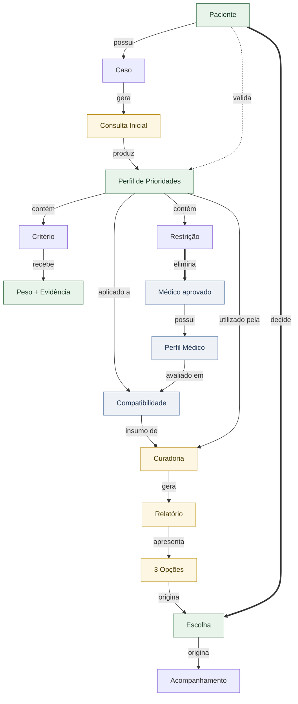
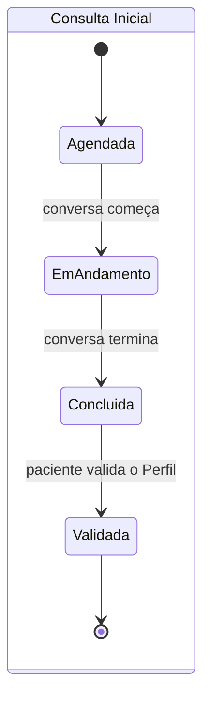
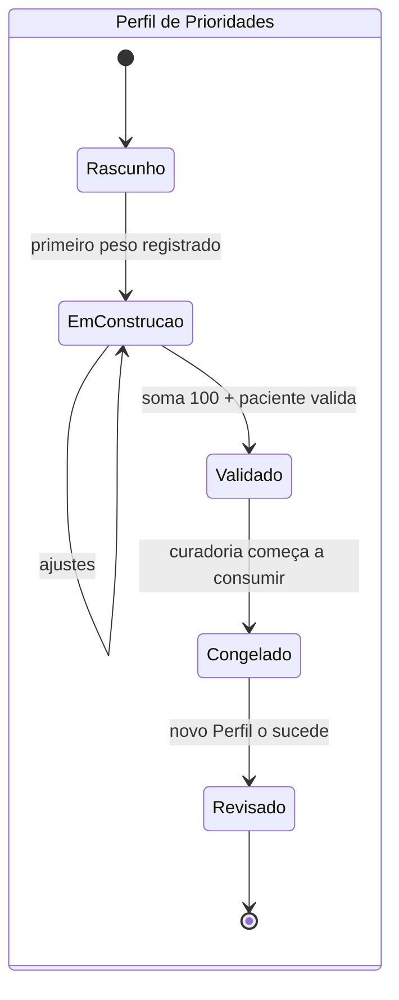
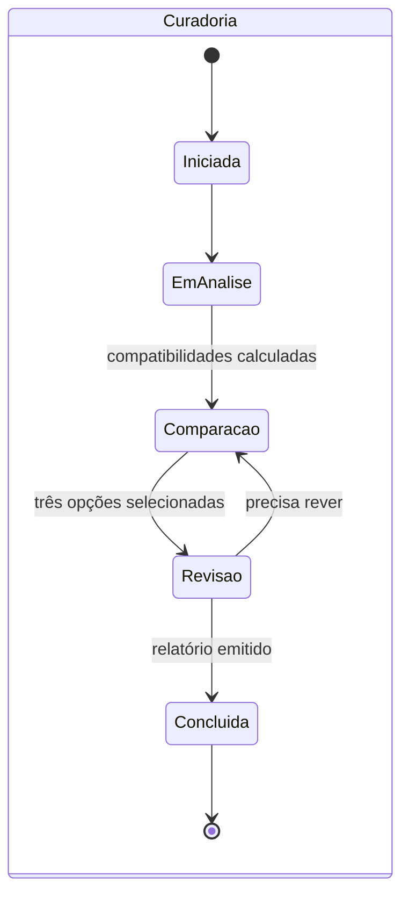

# Ontologia Oficial da Curadoria Compartilhada

**Estado**: **Proposto** — aguardando aprovação do responsável do projeto (`docs/DOCUMENTATION_GOVERNANCE_POLICY.md` §4).

**Autoridade**: este documento é o **modelo de conhecimento oficial da Aliviar**. Toda implementação futura — tela, componente, tabela, API, relatório, treinamento — deve refletir exatamente os conceitos, estados, regras e invariantes definidos aqui. Nunca o contrário: quando a implementação e a Ontologia divergirem, **a Ontologia prevalece e a implementação é corrigida**.

**Relação com os documentos existentes**:

- [`FUNDAMENTOS_DO_METODO_ALIVIAR.md`](FUNDAMENTOS_DO_METODO_ALIVIAR.md) — define **o que a Aliviar é** e como pensa. Continua acima deste documento.
- Esta Ontologia define **o vocabulário e a estrutura** que operacionalizam aquele método.
- [`ace/02-ontology/ontology.md`](ace/02-ontology/ontology.md) — Ontologia do ACE automático. **Não é revogada por este documento**, mas deixa de ser a autoridade sobre o mecanismo de decisão. Os termos equivalentes estão mapeados na seção 10.

**Nesta missão nenhum componente, página, React, Next.js, migration ou UX foi criado ou alterado.** Este documento é conhecimento, não implementação.

---

## 1. Como ler esta Ontologia

Cada entidade é descrita em oito dimensões, sempre na mesma ordem:

| Dimensão | Pergunta que responde |
|---|---|
| **Definição** | O que é, em uma frase. |
| **Propósito** | Por que existe no Método. |
| **Relações** | Com quem se conecta, e em que cardinalidade. |
| **Ciclo de vida** | Quais estados atravessa, do nascimento ao fim. |
| **Responsáveis** | Quem cria, quem altera, quem nunca toca. |
| **Regras** | O que sempre vale sobre ela. |
| **Estados** | O significado exato de cada estado. |
| **Impacto na Curadoria** | O que muda quando ela existe, falta ou falha. |

Uma convenção de leitura: **"nunca"** nesta Ontologia significa *estruturalmente impossível*, não *desaconselhado*.

---

## 2. Atores

Antes das entidades, os três atores. Eles não são artefatos — são quem age sobre os artefatos.

**Paciente** — o decisor. Única autoridade sobre a própria escolha. (Também é entidade; ver §3.1.)

**Curador** — o responsável humano pelo processo, do primeiro encontro à entrega. Conduz a Consulta Inicial, constrói o Perfil junto com o paciente, analisa os médicos aprovados, seleciona as três opções e explica as diferenças. Nunca diagnostica, nunca escolhe pelo paciente.

**Sistema** — registra, organiza, calcula, auxilia e documenta. Nunca conduz, nunca decide, nunca seleciona, nunca pesquisa médicos.

---

## 3. Entidades

### 3.1 Paciente

**Definição** — a pessoa que busca apoio para uma decisão de cuidado. Representa **a pessoa, nunca a doença**.

**Propósito** — ancorar toda a Curadoria em alguém concreto, com história, limites e prioridades próprias. Sem Paciente não existe nada mais neste domínio.

**Relações**
- Possui 0..N **Casos** ao longo da vida.
- É dono de 0..N **Perfis de Prioridades** (um por Caso vigente).
- Realiza 0..N **Escolhas** (uma por Relatório entregue).

**Ciclo de vida** — `Cadastrado → Ativo → Inativo`

**Responsáveis** — criado pela equipe Aliviar (nunca autocadastro público). Os dados pessoais pertencem ao paciente; a equipe mantém o registro.

**Regras**
- Um Paciente nunca é definido por um diagnóstico, condição ou categoria clínica.
- Um Paciente pode ter vários Casos simultâneos, mas cada Caso é independente dos demais.
- Nenhum dado do Paciente é usado para finalidade diferente do cuidado dele mesmo.

**Estados**
| Estado | Significado |
|---|---|
| `Cadastrado` | Registro existe; nenhum Caso aberto ainda. |
| `Ativo` | Tem ao menos um Caso não encerrado. |
| `Inativo` | Sem Casos ativos; o histórico permanece íntegro. |

**Impacto na Curadoria** — é a origem e o destino de tudo. Toda etapa existe para servir a decisão dele.

---

### 3.2 Caso

**Definição** — a situação clínica concreta que originou esta Curadoria.

**Propósito** — delimitar o escopo de uma Curadoria específica. Prioridades, comparações e escolhas só fazem sentido dentro de um Caso.

**Relações**
- Pertence a exatamente 1 **Paciente**.
- Gera 1..N **Consultas Iniciais** (mais de uma quando o Caso é reaberto ou o Perfil é revisado).
- Contém 0..1 **Perfil de Prioridades** vigente (mais os revisados, preservados).
- Origina 0..1 **Curadoria** ativa.

**Ciclo de vida** — `Aberto → Em curadoria → Concluído → Encerrado`, com `Reaberto → Em curadoria` como retorno legítimo.

**Responsáveis** — aberto pela equipe Aliviar; encerrado pelo Paciente (ou administrativamente, em exceção com evidência).

**Regras**
- Um Caso pertence a exatamente um Paciente e nunca é transferido.
- Um Paciente pode ter vários Casos ao longo da vida; cada um tem seu próprio Perfil de Prioridades.
- Um Caso reaberto **nunca reutiliza** o Perfil de Prioridades anterior — prioridades mudam com a vida. Reabrir exige nova Consulta Inicial.
- Um Caso encerrado preserva integralmente todos os seus artefatos.

**Estados**
| Estado | Significado |
|---|---|
| `Aberto` | Existe, sem Consulta Inicial concluída. |
| `Em curadoria` | Há uma Consulta Inicial ou Curadoria em andamento. |
| `Concluído` | Relatório entregue e Escolha registrada. |
| `Encerrado` | Ciclo terminado; nada mais é produzido. |
| `Reaberto` | Voltou a exigir Curadoria; exige nova Consulta Inicial. |

**Impacto na Curadoria** — é o contêiner. Nenhuma Curadoria existe sem Caso.

---

### 3.3 Consulta Inicial

**Definição** — a conversa conduzida pelo Curador com o Paciente. **Não é um formulário** — é um encontro humano do qual nasce o entendimento.

**Propósito** — realizar as três primeiras etapas do raciocínio (Compreender, Estruturar, Priorizar) e produzir o Perfil de Prioridades.

**Relações**
- Pertence a exatamente 1 **Caso**.
- É conduzida por exatamente 1 **Curador**.
- Produz exatamente 1 **Perfil de Prioridades**.

**Ciclo de vida** — `Agendada → Em andamento → Concluída → Validada`

**Responsáveis** — conduzida exclusivamente pelo Curador. O Sistema **acompanha e registra**; nunca conduz, nunca pergunta pelo Curador, nunca preenche por inferência.

**Regras**
- Uma Consulta Inicial nunca é substituída por um formulário preenchido pelo Paciente sozinho.
- Nenhum conteúdo da Consulta é inferido pelo Sistema — tudo é registrado a partir do que foi dito.
- A Consulta só chega a `Validada` quando o Paciente valida o Perfil de Prioridades produzido nela.
- Uma Consulta `Concluída` mas não `Validada` não habilita nenhuma etapa seguinte.

**Estados**
| Estado | Significado |
|---|---|
| `Agendada` | Marcada, ainda não aconteceu. |
| `Em andamento` | Conversa acontecendo; registro sendo construído. |
| `Concluída` | Conversa terminou; Perfil montado, ainda não validado pelo Paciente. |
| `Validada` | O Paciente reconheceu o Perfil como seu. Só aqui a Consulta cumpriu seu propósito. |

**Impacto na Curadoria** — é a origem de todo o resto. Sem Consulta Inicial validada, não há Perfil; sem Perfil, não há Compatibilidade; sem Compatibilidade, não há Curadoria.

---

### 3.4 Perfil de Prioridades

**Definição** — o **primeiro patrimônio construído em conjunto entre Paciente e Curador**. Representa, de forma estruturada e validada, aquilo que orientará todas as etapas seguintes da Curadoria.

**Propósito** — transformar uma história em critério. É o artefato central do Método: tudo antes dele existe para construí-lo, tudo depois dele existe para aplicá-lo.

**Composição** — um Perfil contém:
- 0..N **Restrições** (obrigatórias, eliminatórias, sem peso)
- 1..N **Critérios** com seus **Pesos** (somando exatamente 100)
- 0..N **Observações** (preferências e nuances registradas em linguagem do Paciente)
- exatamente 1 **Validação** do Paciente

**Relações**
- Produzido por exatamente 1 **Consulta Inicial**.
- Pertence a exatamente 1 **Caso** e, por ele, a 1 **Paciente**.
- É utilizado por 0..1 **Curadoria**.
- Origina 0..N **Compatibilidades** (uma por Médico elegível).
- Pode ser sucedido por 1 novo Perfil (revisão).

**Ciclo de vida** — `Rascunho → Em construção → Validado → Congelado → Revisado`

**Responsáveis** — construído pelo Curador **junto com** o Paciente. Validado exclusivamente pelo Paciente. Depois de validado, ninguém altera — nem o Curador, nem o Sistema, nem um administrador.

**Regras**
- Não pode existir sem Consulta Inicial.
- Não pode ser utilizado sem validação do Paciente.
- Os Pesos devem somar **exatamente 100**.
- **Restrições não entram na distribuição dos Pesos** — elas eliminam, não pesam.
- Todo Peso carrega obrigatoriamente sua **Evidência de Curadoria**.
- Nunca é inferido automaticamente, em nenhuma circunstância.
- Pertence ao Paciente — o Curador ajuda a formular, nunca substitui a preferência dele pela própria.
- É específico e datado: vale para **aquele Caso, naquele momento**. Nunca é um cadastro permanente do Paciente.
- Pode evoluir e ser revisado — sempre criando um **novo** Perfil, nunca reescrevendo o anterior.

**Estados**
| Estado | Significado |
|---|---|
| `Rascunho` | Criado na Consulta; nada registrado ainda. |
| `Em construção` | Tem conteúdo, mas ainda não fecha 100 pontos ou falta evidência. |
| `Validado` | O Paciente reconheceu: "é isso que importa para mim". Torna-se imutável. |
| `Congelado` | Está sendo consumido por uma Curadoria em andamento. |
| `Revisado` | Foi sucedido por um novo Perfil. Preservado íntegro, nunca apagado. |

**Impacto na Curadoria** — define o que será comparado e como. Trocando o Perfil, toda a análise muda — inclusive quais médicos aparecem e em que faixa.

---

### 3.5 Critério

**Definição** — qualquer aspecto que possa influenciar a decisão do Paciente.

**Propósito** — dar nome ao que importa, para que possa receber peso e ser comparado.

**Catálogo oficial** (aberto — novos Critérios entram por decisão, nunca por inferência):

| Critério | O que representa |
|---|---|
| Experiência | Trajetória e volume de prática do médico. |
| Comunicação | Como o médico explica, escuta e se relaciona. |
| Hospital | A instituição onde o médico atende. |
| Convênio | Cobertura e condição financeira do atendimento. |
| Cidade | A região onde o atendimento acontece. |
| Tecnologia | Recursos e técnicas disponíveis. |
| Disponibilidade | Rapidez e flexibilidade para começar. |

**Relações**
- Recebe exatamente 1 **Peso** dentro de um **Perfil de Prioridades**.
- É avaliado contra 1 **Perfil Médico** para produzir uma dimensão da **Compatibilidade**.

**Ciclo de vida** — o Critério em si é **catálogo**, não tem ciclo próprio. Sua instância dentro de um Perfil vive e morre com aquele Perfil.

**Responsáveis** — o catálogo é mantido pela Aliviar. A escolha de quais Critérios entram em um Perfil é do Curador com o Paciente.

**Regras**
- Um mesmo aspecto (ex.: Cidade) pode aparecer como **Critério** (pesa) ou como **Restrição** (elimina) — **nunca como os dois no mesmo Perfil**. Ou é negociável e pesa, ou é inegociável e elimina.
- Um Critério só entra em um Perfil se o Paciente o reconheceu como relevante para ele.
- Um Critério sem Peso não existe dentro de um Perfil.

**Estados** — não aplicável ao catálogo. Instância dentro do Perfil: `Proposto → Pesado → Validado`.

**Impacto na Curadoria** — define as dimensões da comparação. Nenhuma dimensão de Compatibilidade existe sem um Critério que a origine.

---

### 3.6 Peso

**Definição** — a importância atribuída **pelo Paciente** a um Critério. **Nunca representa qualidade de médico.**

**Propósito** — resolver o que fazer quando duas coisas boas não cabem juntas. Prioridade sem peso não decide nada.

**Composição** — um Peso é sempre o par: **valor** (0-100 pontos) + **Evidência de Curadoria**.

**Evidência de Curadoria** — o registro do momento da conversa que originou aquele peso. Exemplo:

> **Experiência — 35 pontos**
> *Evidência:* "Para mim isso é o mais importante" — dito pelo Paciente durante a validação do Perfil de Prioridades.

**Relações**
- Pertence a exatamente 1 **Perfil de Prioridades**.
- Qualifica exatamente 1 **Critério**.
- Carrega exatamente 1 **Evidência de Curadoria**.

**Ciclo de vida** — vive dentro do Perfil: `Atribuído → Validado → Congelado`.

**Responsáveis** — o valor é do **Paciente**. O Curador conduz a conversa que o revela e registra a evidência. O Sistema nunca sugere, calcula ou ajusta um Peso.

**Regras**
- A soma de todos os Pesos de um Perfil é **exatamente 100**.
- **Peso sem Evidência de Curadoria não existe.**
- O Peso nunca é pedido ao Paciente como número — nasce da conversa ("se tivesse que abrir mão de uma, qual seria?") e é formalizado pelo Curador.
- Um Peso nunca é inferido de comportamento, histórico ou de casos parecidos.
- Restrições nunca recebem Peso.
- Os Pesos **são visíveis ao Paciente** — são a importância que ele mesmo atribuiu, e mostrá-los é transparência, não exposição de nota.

**Estados**
| Estado | Significado |
|---|---|
| `Atribuído` | Registrado com evidência; o Perfil ainda não fecha 100. |
| `Validado` | Faz parte de um Perfil validado pelo Paciente. |
| `Congelado` | Imutável; qualquer mudança exige novo Perfil. |

**Impacto na Curadoria** — determina quanto cada dimensão influencia a Compatibilidade. É o mecanismo pelo qual a decisão continua sendo do Paciente mesmo dentro de um cálculo.

---

### 3.7 Restrição

**Definição** — um requisito **obrigatório** do Paciente. Elimina opções.

**Propósito** — remover do universo de comparação o que não serve de forma alguma, antes de qualquer cálculo.

**Catálogo oficial** (aberto):

| Restrição | O que exige |
|---|---|
| Cidade | Atendimento em uma região específica. |
| Convênio | Aceitação de uma cobertura específica. |
| Hospital | Vínculo com uma instituição específica. |
| Especialidade | Atuação em uma especialidade específica. |
| Modalidade | Forma de atendimento (presencial, remoto). |

**Relações**
- Pertence a exatamente 1 **Perfil de Prioridades**.
- É avaliada contra 1..N **Perfis Médicos**, eliminando os que não atendem.

**Ciclo de vida** — vive dentro do Perfil: `Declarada → Validada → Congelada`.

**Responsáveis** — declarada pelo Paciente, registrada pelo Curador.

**Regras**
- **Restrições eliminam. Não recebem Peso.** Nunca entram na distribuição dos 100 pontos.
- Uma Restrição é binária: o médico atende ou não atende. Não existe "atende parcialmente".
- Toda eliminação por Restrição é registrada com o motivo em linguagem humana — nunca um descarte silencioso.
- Se as Restrições eliminarem o universo inteiro, isso é comunicado com honestidade ao Paciente. **Nunca se afrouxa uma Restrição sem falar com ele.**
- Um aspecto declarado como Restrição não pode simultaneamente ser Critério no mesmo Perfil.

**Estados**
| Estado | Significado |
|---|---|
| `Declarada` | Registrada durante a Consulta. |
| `Validada` | Parte de um Perfil validado. |
| `Congelada` | Imutável junto com o Perfil. |

**Impacto na Curadoria** — define **quem entra** na comparação. Os Pesos definem **como se comparam** os que entraram.

---

### 3.8 Médico

**Definição** — um profissional **previamente aprovado pela Aliviar**. Nunca pesquisado automaticamente, nunca criado automaticamente.

**Propósito** — constituir o universo fechado e curado sobre o qual qualquer Compatibilidade opera.

**Relações**
- Possui exatamente 1 **Perfil Médico**.
- Participa de 0..N **Compatibilidades** (uma por Perfil de Prioridades avaliado).
- Pode ser apresentado em 0..N **Opções**.
- Pode ser destino de 0..N **Escolhas**.

**Ciclo de vida** — `Em avaliação → Aprovado → Ativo → Suspenso → Desligado`

**Responsáveis** — aprovado exclusivamente pela equipe Aliviar, por critérios próprios, **anteriores e independentes de qualquer Paciente**.

**Regras**
- **A aprovação nunca é comprada** — nem posição, nem destaque, nem entrada no universo, nem prioridade de apresentação.
- A aprovação é anterior à Curadoria e independente dela. A Compatibilidade não qualifica ninguém: a qualificação já aconteceu.
- Nenhum médico entra no universo por busca automática, importação ou sugestão do Sistema.
- Um médico `Suspenso` ou `Desligado` nunca entra em novas comparações, mas permanece íntegro nos Relatórios já entregues.

**Estados**
| Estado | Significado |
|---|---|
| `Em avaliação` | Candidato; ainda não aprovado. |
| `Aprovado` | Passou pelo critério da Aliviar. |
| `Ativo` | Aprovado e disponível para comparação. |
| `Suspenso` | Temporariamente fora das comparações. |
| `Desligado` | Fora da Rede; histórico preservado. |

**Impacto na Curadoria** — é o universo. Sem médicos aprovados, o "Comparar" não tem sobre o que operar.

---

### 3.9 Perfil Médico

**Definição** — todas as características relevantes do médico. **Nunca muda conforme o paciente.**

**Propósito** — ser o lado estável da comparação. É contra ele que o Perfil de Prioridades é aplicado.

**Relações**
- Pertence a exatamente 1 **Médico**.
- É insumo de 0..N **Compatibilidades**.

**Ciclo de vida** — `Incompleto → Completo → Desatualizado → Atualizado`

**Responsáveis** — mantido pela equipe Aliviar. Nunca alterado por uma Curadoria, por um Curador durante uma análise, ou pelo Sistema por inferência.

**Regras**
- **É invariante em relação ao Paciente.** O mesmo Perfil Médico serve a todas as Curadorias, sem exceção.
- Nenhum campo é preenchido por inferência. Ausência de dado é ausência — nunca um valor presumido.
- Um campo ausente **nunca é tratado como nota baixa**: é registrado como lacuna explícita e visível ao Curador.
- Alterar um Perfil Médico nunca reescreve retroativamente Compatibilidades já calculadas.

**Estados**
| Estado | Significado |
|---|---|
| `Incompleto` | Faltam características relevantes; comparações o incluem com lacunas sinalizadas. |
| `Completo` | Todas as características relevantes registradas. |
| `Desatualizado` | Passou do prazo de revisão; sinalizado ao Curador. |
| `Atualizado` | Revisado e vigente. |

**Impacto na Curadoria** — a qualidade do Perfil Médico limita a confiança de toda análise. Um universo com perfis incompletos produz Compatibilidades honestas, porém menos informativas — e isso precisa ser visível.

---

### 3.10 Compatibilidade

**Definição** — o encontro entre um **Perfil Médico** e um **Perfil de Prioridades**.

> A compatibilidade não mede o valor de um médico. Ela mede o quanto um profissional atende às prioridades específicas construídas com aquele paciente. O mesmo médico pode apresentar alta compatibilidade para um paciente e baixa para outro. Por isso a Aliviar nunca produz rankings universais. Produz análises contextualizadas.

**É uma característica da relação, nunca do médico.**

**Propósito** — dar ao Curador uma base objetiva de comparação, e ao Paciente uma leitura clara de como cada opção responde ao que ele declarou importante.

**Os dois níveis**

| | Nível interno | Nível externo |
|---|---|---|
| **O que é** | Valor calculado (ex.: 92, 87, 84) | Faixa qualitativa e distribuição por Critério |
| **Para quem** | Exclusivamente o Curador | O Paciente |
| **Por quê** | Ferramenta objetiva de comparação | Comunicação contextualizada |
| **Nunca** | Chega ao Paciente | Vira ranking absoluto entre as três opções |

Faixas do nível externo: **Muito Alta**, **Alta**, **Boa**, **Moderada**.

**Relações**
- Nasce de exatamente 1 **Perfil Médico** × 1 **Perfil de Prioridades**.
- Contém 1..N resultados por **Critério** (peso, alinhamento, explicação).
- É insumo de exatamente 1 **Curadoria**.

**Ciclo de vida** — `Não calculada → Calculada → Invalidada`

**Responsáveis** — calculada pelo Sistema. **O Sistema calcula; nunca seleciona, nunca recomenda, nunca decide.**

**Regras**
- Nunca existe sem um Perfil de Prioridades **validado**.
- Só opera sobre médicos **previamente aprovados** que passaram por todas as Restrições.
- É sempre relativa: o mesmo médico muda de faixa quando o Perfil muda.
- **Nunca produz ranking universal** — não existe "o mais compatível" fora de um Perfil específico.
- Toda Compatibilidade é explicável em linguagem simples: *"esta opção pesa mais porque você disse que X importa mais que Y"*. O que não passa nesse teste não pode ser usado.
- Critério sem dado no Perfil Médico não pontua e não penaliza — é sinalizado como lacuna.
- É invalidada automaticamente quando o Perfil de Prioridades é revisado.

**Estados**
| Estado | Significado |
|---|---|
| `Não calculada` | O Perfil ainda não foi validado, ou a comparação não foi executada. |
| `Calculada` | Existe e é válida para o Perfil vigente. |
| `Invalidada` | O Perfil foi revisado; esta análise não vale mais e nunca é reaproveitada. |

**Impacto na Curadoria** — organiza a leitura do Curador. **Nunca decide por ele.**

---

### 3.11 Curadoria

**Definição** — o processo técnico realizado pelo Curador: aplicar o Perfil validado ao universo aprovado, justificar as análises e selecionar as três opções.

**Propósito** — transformar análise em opções compreensíveis, com autoria humana em todas as decisões.

**Relações**
- Pertence a exatamente 1 **Caso**.
- Consome exatamente 1 **Perfil de Prioridades** validado.
- Consome 0..N **Compatibilidades**.
- Produz exatamente 1 **Relatório**.
- É conduzida por exatamente 1 **Curador**.

**Ciclo de vida** — `Iniciada → Em análise → Comparação → Revisão → Concluída`

**Responsáveis** — inteiramente do Curador. O Sistema apoia em cada etapa e não decide em nenhuma.

**Regras**
- Nunca existe sem Caso.
- Nunca começa sem Perfil de Prioridades validado.
- **A seleção final das opções pertence exclusivamente ao Curador** — o algoritmo pode calcular, comparar, organizar e sugerir, mas nunca seleciona.
- São sempre **exatamente três** opções. Nunca uma, nunca duas, nunca um vencedor, nunca um ranking.
- Se não for possível formar três opções legitimamente fundamentadas, isso é declarado com honestidade — nunca completado com uma opção fraca.
- Toda análise usada precisa ter justificativa em linguagem humana antes de a seleção acontecer.
- Toda Curadoria tem autoria humana nomeada e registrada.

**Estados**
| Estado | Significado |
|---|---|
| `Iniciada` | Perfil validado disponível; análise não começou. |
| `Em análise` | O Curador estuda o Perfil e o universo aprovado. |
| `Comparação` | Compatibilidades calculadas e sendo lidas. |
| `Revisão` | As três opções escolhidas e justificadas; conferência final. |
| `Concluída` | Relatório emitido. |

**Impacto na Curadoria** — é o processo em si. É aqui que competência humana e cálculo se encontram.

---

### 3.12 Relatório

**Definição** — o documento entregue ao Paciente.

**Propósito** — apresentar as três opções de forma clara, fiel e útil, para que o Paciente possa decidir com consciência.

**Composição** — o Relatório apresenta:
- o **Perfil de Prioridades** validado, com os **Pesos** e suas evidências;
- as três **Opções**, cada uma com faixa de compatibilidade, justificativa e o que ela custa;
- a explicação do que diferencia as opções entre si.

**Relações**
- Produzido por exatamente 1 **Curadoria**.
- Apresenta exatamente 3 **Opções**.
- Origina exatamente 1 **Escolha**.

**Ciclo de vida** — `Em elaboração → Emitido → Entregue`

**Responsáveis** — montado pelo Sistema a partir do que a Curadoria produziu; **entregue por um Curador**, nunca por notificação automática silenciosa.

**Regras**
- Nunca existe sem Curadoria.
- Nunca contém score interno de compatibilidade.
- Nunca usa linguagem de ranking, colocação, vencedor ou "melhor opção".
- A **ordem das opções é ordem de apresentação, nunca colocação** — não é um pódio.
- Nunca contém diagnóstico, conduta clínica ou promessa de resultado.
- Nunca nomeia mecanismo interno da Aliviar.
- Depois de entregue, é imutável.

**Estados**
| Estado | Significado |
|---|---|
| `Em elaboração` | Curadoria em Revisão; conteúdo sendo montado. |
| `Emitido` | Conteúdo fechado; ainda não apresentado. |
| `Entregue` | Apresentado ao Paciente por um Curador. Torna-se imutável. |

**Impacto na Curadoria** — é o que o Paciente efetivamente vive. Todo o rigor anterior só tem valor se chegar compreensível aqui.

---

### 3.13 Opção

**Definição** — um dos três caminhos apresentados no Relatório: um Médico, com a justificativa de por que ele está ali.

**Propósito** — dar ao Paciente alternativas legítimas e diferentes entre si, com o que cada uma oferece e o que cada uma custa.

**Relações**
- Pertence a exatamente 1 **Relatório**.
- Aponta para exatamente 1 **Médico**.
- Deriva de exatamente 1 **Compatibilidade**.
- Pode ser destino de 0..1 **Escolha**.

**Ciclo de vida** — `Selecionada → Apresentada → Escolhida` ou `Não escolhida`

**Responsáveis** — selecionada exclusivamente pelo Curador.

**Regras**
- Toda Opção carrega faixa qualitativa, justificativa individual e, quando existir, o que ela custa (trade-off).
- As três Opções são caminhos diferentes, não variações do mesmo caminho.
- Nenhum recurso de apresentação (ordem, cor, tamanho, destaque, entusiasmo) pode sugerir um vencedor.

**Estados**
| Estado | Significado |
|---|---|
| `Selecionada` | Escolhida pelo Curador para compor o Relatório. |
| `Apresentada` | Entregue ao Paciente. |
| `Escolhida` | O Paciente a escolheu. |
| `Não escolhida` | O Paciente escolheu outra, ou nenhuma. |

**Impacto na Curadoria** — é a unidade de decisão do Paciente.

---

### 3.14 Escolha

**Definição** — a decisão final do Paciente.

**Propósito** — encerrar a Curadoria com uma decisão consciente e registrada, tomada por quem tem autoridade sobre ela.

**Relações**
- Nasce de exatamente 1 **Relatório**.
- Aponta para 0..1 **Opção** (zero quando nenhuma serviu).
- Pode originar 1 **Acompanhamento**.

**Ciclo de vida** — `Aguardando → Registrada`

**Responsáveis** — **exclusivamente do Paciente.** Nem Curador, nem administrador, nem Sistema registram uma Escolha em nome dele.

**Regras**
- Nunca existe sem Relatório entregue.
- **"Nenhuma destas" é um desfecho legítimo e registrado** — significa que alguma etapa anterior não capturou algo, nunca uma falha do Paciente.
- Acontece no tempo do Paciente. Nunca há prazo artificial, lembrete com urgência fabricada, ou tratamento da demora como problema.
- Escolher a opção que o Curador consideraria menos indicada é uma decisão válida — e o Método funcionou.
- Uma Escolha registrada é imutável; mudar de ideia gera um novo fato, nunca a reescrita do anterior.

**Estados**
| Estado | Significado |
|---|---|
| `Aguardando` | Relatório entregue; o Paciente ainda pensa. |
| `Registrada` | Decisão tomada — uma opção escolhida, ou nenhuma delas. |

**Impacto na Curadoria** — encerra o ciclo. Uma Escolha `Nenhuma destas` devolve o Caso ao raciocínio, normalmente à etapa Priorizar.

---

### 3.15 Acompanhamento

**Definição** — a continuidade do cuidado depois da Escolha.

**Propósito** — sustentar que a Aliviar acompanha uma jornada, não resolve uma transação isolada.

**Relações**
- Nasce de exatamente 1 **Escolha** com opção escolhida.
- Pertence a 1 **Caso**.

**Ciclo de vida** — `Aguardando primeiro contato → Em andamento → Encerrado → Reaberto`

**Responsáveis** — o Paciente relata os fatos; a equipe Aliviar acompanha e organiza.

**Regras**
- Nunca existe sem Escolha registrada com uma Opção.
- Nenhum fato do Acompanhamento altera retroativamente o Relatório ou o Perfil.
- A troca de profissional é decisão exclusiva do Paciente e pode originar uma reavaliação — nunca automática.

**Estados**
| Estado | Significado |
|---|---|
| `Aguardando primeiro contato` | Escolha feita; atendimento ainda não ocorreu. |
| `Em andamento` | Relação de cuidado ativa. |
| `Encerrado` | Relação terminada. |
| `Reaberto` | Nova necessidade; pode originar novo Caso. |

**Impacto na Curadoria** — fecha o ciclo e alimenta o aprendizado da Aliviar sobre o que funcionou.

---

## 4. Diagrama do domínio



**Legenda de autoria** — verde: pertence ao Paciente. Amarelo: conduzido por um humano da Aliviar. Azul: produzido ou mantido pelo Sistema. Nenhuma seta azul chega em `Escolha` ou em `3 Opções`: o Sistema nunca seleciona nem decide.

### Cadeia canônica

```
Paciente → possui → Caso → gera → Consulta Inicial → produz → Perfil de Prioridades
   → utilizado pela → Curadoria → gera → Relatório → apresenta → Opções
   → Escolha → Acompanhamento
```

---

## 5. Ciclos de vida







| Entidade | Estados |
|---|---|
| Paciente | `Cadastrado → Ativo → Inativo` |
| Caso | `Aberto → Em curadoria → Concluído → Encerrado` (+ `Reaberto`) |
| Consulta Inicial | `Agendada → Em andamento → Concluída → Validada` |
| Perfil de Prioridades | `Rascunho → Em construção → Validado → Congelado → Revisado` |
| Critério (instância) | `Proposto → Pesado → Validado` |
| Peso | `Atribuído → Validado → Congelado` |
| Restrição | `Declarada → Validada → Congelada` |
| Médico | `Em avaliação → Aprovado → Ativo → Suspenso → Desligado` |
| Perfil Médico | `Incompleto → Completo → Desatualizado → Atualizado` |
| Compatibilidade | `Não calculada → Calculada → Invalidada` |
| Curadoria | `Iniciada → Em análise → Comparação → Revisão → Concluída` |
| Relatório | `Em elaboração → Emitido → Entregue` |
| Opção | `Selecionada → Apresentada → Escolhida \| Não escolhida` |
| Escolha | `Aguardando → Registrada` |
| Acompanhamento | `Aguardando primeiro contato → Em andamento → Encerrado → Reaberto` |

---

## 6. Invariantes

Invariantes são verdades que **nunca** podem ser falsas, em nenhum estado do sistema, em nenhuma circunstância.

### Existência

1. **Caso** nunca existe sem **Paciente**.
2. **Consulta Inicial** nunca existe sem **Caso**.
3. **Perfil de Prioridades** nunca existe sem **Consulta Inicial**.
4. **Compatibilidade** nunca existe sem **Perfil de Prioridades validado**.
5. **Curadoria** nunca existe sem **Caso**.
6. **Curadoria** nunca começa sem **Perfil de Prioridades validado**.
7. **Relatório** nunca existe sem **Curadoria**.
8. **Escolha** nunca existe sem **Relatório entregue**.
9. **Acompanhamento** nunca existe sem **Escolha com Opção escolhida**.
10. **Peso** nunca existe sem **Evidência de Curadoria**.
11. **Opção** nunca existe sem **Compatibilidade** que a fundamente.

### Autoria

12. Nenhum **Perfil de Prioridades** é validado por outro que não o **Paciente**.
13. Nenhuma **seleção das três Opções** tem autor que não seja o **Curador**.
14. Nenhuma **Escolha** tem autor que não seja o **Paciente**.
15. Nenhuma decisão do Método tem o **Sistema** como autor.

### Quantidade

16. A soma dos **Pesos** de um Perfil validado é **exatamente 100**.
17. Todo **Relatório** apresenta **exatamente três Opções**.
18. Um **Caso** tem no máximo **um Perfil de Prioridades vigente** por vez.
19. Um **Médico** aparece no máximo **uma vez** no mesmo Relatório.

### Natureza

20. **Restrição nunca recebe Peso.**
21. **Peso nunca representa qualidade de médico** — só importância declarada pelo Paciente.
22. **Compatibilidade nunca é característica de um Médico** — é característica da relação entre um Perfil Médico e um Perfil de Prioridades.
23. **Perfil Médico nunca muda em função de um Paciente.**
24. Um mesmo aspecto nunca é **Critério e Restrição** no mesmo Perfil.
25. **Nenhum ranking universal** é produzido, armazenado ou exibido em qualquer ponto do domínio.
26. O **score interno** de Compatibilidade nunca é visível ao Paciente.
27. Os **Pesos** são sempre visíveis ao Paciente.

### Imutabilidade

28. **Perfil de Prioridades validado** é imutável — revisão cria um novo, nunca reescreve o anterior.
29. **Relatório entregue** é imutável.
30. **Escolha registrada** é imutável.
31. **Compatibilidade** é invalidada quando o Perfil que a originou é revisado — nunca reaproveitada silenciosamente.
32. Nenhum artefato é apagado; estados terminais preservam o histórico íntegro.

### Informação

33. Nada é **inferido automaticamente** no Perfil de Prioridades.
34. Ausência de dado no Perfil Médico é registrada como **lacuna**, nunca convertida em nota baixa.
35. Toda eliminação por Restrição carrega **motivo em linguagem humana**.
36. Toda Compatibilidade carrega **explicação em linguagem simples** — o que não pode ser explicado não pode ser usado.

---

## 7. Glossário oficial

| Termo | Definição curta |
|---|---|
| **Acompanhamento** | Continuidade do cuidado após a Escolha. |
| **Caso** | A situação clínica que originou a Curadoria. |
| **Compatibilidade** | O encontro entre Perfil Médico e Perfil de Prioridades. Característica da relação, nunca do médico. |
| **Consulta Inicial** | A conversa conduzida pelo Curador. Nunca um formulário. |
| **Critério** | Aspecto que pode influenciar a decisão. |
| **Curador** | Responsável humano pelo processo, do primeiro encontro à entrega. |
| **Curadoria** | O processo técnico realizado pelo Curador. |
| **Escolha** | A decisão final do Paciente. |
| **Evidência de Curadoria** | O momento da conversa que originou um Peso. |
| **Faixa de Compatibilidade** | Leitura qualitativa (Muito Alta, Alta, Boa, Moderada) — o único nível que chega ao Paciente. |
| **Médico** | Profissional previamente aprovado pela Aliviar. |
| **Nível externo** | O que o Paciente recebe: faixa e distribuição por Critério. |
| **Nível interno** | O valor calculado, ferramenta exclusiva do Curador. |
| **Opção** | Um dos três caminhos apresentados no Relatório. |
| **Paciente** | A pessoa. Nunca a doença. |
| **Perfil de Prioridades** | O primeiro patrimônio construído em conjunto entre Paciente e Curador. |
| **Perfil Médico** | Todas as características relevantes do médico. Nunca muda conforme o paciente. |
| **Peso** | Importância atribuída pelo Paciente a um Critério. Nunca qualidade de médico. |
| **Relatório** | O documento entregue ao Paciente. |
| **Restrição** | Requisito obrigatório. Elimina opções. Não recebe peso. |
| **Sistema** | Registra, organiza, calcula, auxilia, documenta. Nunca decide. |
| **Validação** | O ato do Paciente reconhecer o Perfil como seu. Sem ele, o Perfil não existe de fato. |

---

## 8. Termos explicitamente fora deste vocabulário

- **Melhor médico** — a Aliviar nunca responde essa pergunta.
- **Ranking** / **colocação** / **pódio** / **vencedor** — não existem neste domínio. Posição é ordem de apresentação.
- **Nota do médico** / **avaliação** / **reputação** — Peso não é nota; Compatibilidade não é nota.
- **Recomendação automática** — o Sistema nunca recomenda.
- **Busca de médicos** — o universo é fechado e previamente aprovado; não há pesquisa automática nem cadastro automático.
- **Diagnóstico**, **conduta clínica**, **prescrição** — pertencem exclusivamente ao médico, fora da Aliviar.

---

## 9. Divergências com a implementação atual

Registradas para rastreabilidade, conforme `docs/DOCUMENTATION_GOVERNANCE_POLICY.md`. **A Ontologia é a autoridade; a implementação é que se ajusta.** Nenhuma foi corrigida nesta missão — nenhum código foi tocado.

| # | Divergência | Situação |
|---|---|---|
| 1 | **Consulta Inicial não existe como entidade própria** — na Etapa 2 ela está fundida ao Perfil de Prioridades. A Ontologia as separa, com ciclos de vida distintos (`Agendada→...→Validada` vs `Rascunho→...→Revisado`). | Exige separar as duas entidades. |
| 2 | **Catálogo de Critérios incompleto** — a implementação instrumenta 6 critérios mapeados a dado real (Experiência, Área de atuação, Disponibilidade, Continuidade, Abordagem inicial, Localização). A Ontologia oficializa 7, dos quais **Comunicação, Hospital, Convênio e Tecnologia não têm dado correspondente** em nenhum cadastro hoje. | Exige campos novos no Perfil Médico antes de os Critérios existirem de fato. |
| 3 | **Catálogo de Restrições incompleto** — Convênio, Hospital e Modalidade não têm dado correspondente no cadastro do médico. | Mesma origem do item 2. |
| 4 | **Estados `Congelado` e `Revisado` do Perfil** — a implementação tem `DRAFT`/`VALIDATED`/`SUPERSEDED`; falta distinguir "validado" de "em uso por uma Curadoria". | Exige um estado a mais. |
| 5 | **Curadoria não é entidade própria** — os cinco estados (`Iniciada→...→Concluída`) não existem; hoje o processo é inferido da existência de outros registros. | Exige entidade e máquina de estados próprias. |
| 6 | **Relatório não é entidade própria** — hoje é derivado da seleção entregue, sem os estados `Em elaboração/Emitido/Entregue`. | Exige entidade própria. |
| 7 | **Perfil Médico sem ciclo de vida** — não há `Incompleto/Completo/Desatualizado`. | Exige campo de estado e política de revisão. |
| 8 | **Médico sem os estados de aprovação** — hoje só `ativo`/`inativo`; falta `Em avaliação`, `Aprovado`, `Suspenso`, `Desligado`. A aprovação prévia, que é constitutiva do Método, não é modelada. | Exige máquina de estados própria. |

---

## 10. Mapeamento com a Ontologia do ACE

Para quem precisar ler os artefatos já produzidos pelo pipeline anterior.

| Ontologia do ACE | Curadoria Compartilhada | Diferença essencial |
|---|---|---|
| Cliente | Paciente | Terminologia. |
| História (Narrative) | Consulta Inicial (etapa Compreender) | Deixa de ser produzida por IA; passa a ser conduzida por humano. |
| Caso (DecisionCase) | Caso | O Caso passa a ser a situação clínica, não a estruturação da narrativa. |
| Contexto de Decisão | Perfil de Prioridades | Deixa de ser inferido; passa a ser co-construído e validado pelo Paciente. |
| Restrição Obrigatória | Restrição | Equivalente. |
| Preferência | Observação do Perfil | Equivalente. |
| Care Provider | Médico | Vocabulário do Método passa a ser "Médico". |
| Matriz de Compatibilidade | Compatibilidade | Ganha os dois níveis (interno e externo) e pesos do Paciente. |
| Shortlist (P008) | — | **Deixa de existir**: nenhum artefato de sistema seleciona três. |
| Human Review (P009) | Curadoria | O humano deixa de revisar no fim e passa a conduzir desde o início. |
| Curadoria Final (P010) | Relatório | Equivalente em propósito. |

---

## 11. Histórico

| Versão | Data | Mudança |
|---|---|---|
| 0.1 | 2026-07-23 | Primeira versão — MISSÃO 003. 15 entidades (13 solicitadas + Opção + Acompanhamento), 3 atores, cadeia canônica de relações, 15 ciclos de vida, 36 invariantes, glossário oficial, diagrama do domínio e diagramas de estado. 8 divergências com a implementação registradas sem correção. Nenhum componente, página, React, Next.js, migration ou UX criado ou alterado. |
